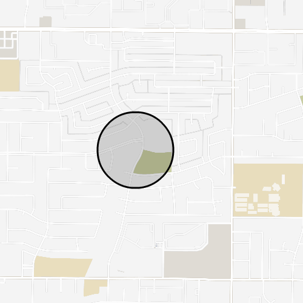

# Find Shai


## About the project


## Running the project

1. Set up aws cli and credentials

First get started by [setting up the AWS CLI](https://docs.aws.amazon.com/cli/latest/userguide/getting-started-quickstart.html). Then make sure you have the [required permissions](https://docs.aws.amazon.com/amplify/latest/userguide/security-iam-awsmanpol.html) for AWS Amplify. 

2. Prepare the project by running:
```
npm install
``` 


3. Next, run the following command to inizialize [AWS Amplify](https://docs.amplify.aws/):

```
npx ampx sandbox
```

Now Find Shai is ready to go!


### Running the mobile app:

```
cd find-shai-mobile-app
npm install
npm run start
```


